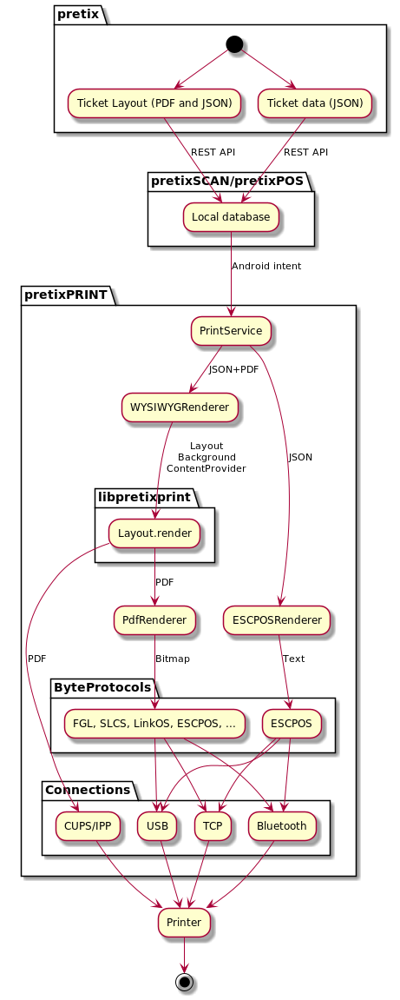

pretixPRINT
===========

Android app that drives the printers used by other pretix applications. This contains all
print logic, but no application logic. It is called by other applications using system
broadcasts.

Printer Compatibility
---------------------

| Printer type | Network | USB | Bluetooth | Allowed for |
| -- | -- | -- | -- | -- |
| FGL ticket printers (Boca, Practical Automation) | ✔️ | ✔️ | ❓ | Ticket printing, badge printing |
| SLCS label printers (Bixolon, Metapace) | ✔️ | ✔️ | ❓ | Ticket printing, badge printing |
| ESC/POS recept printers (Epson, Bixolon, SNBC, Metapace, …) | ✔️ | ✔️ | ✔️ (some) | Ticket printing, badge printing, receipt printing |
| Brother label printers (QL series) | ✔️ | ✔️ |  | Ticket printing, badge printing |
| Zebra label printers | ✔️ | ✔️ | ❓ | Ticket printing, badge printing |
| Zebra card printers (ZC, ZXP series) | ✔️ | ✔️ | ❓ | Ticket printing, badge printing |
| Printers connected to a Linux CUPS service, some IPP printers | ✔️ |  |  | Ticket printing, badge printing |

Architecture
------------

Building
--------

This app comes in two flavors, ``foss`` and ``full``. ``foss`` only supports printers implemented
fully using free software and can be simply built using

	./gradlew assembleFossDebug

If you want to perform a full build, you need to do get a few libraries first:

* Download the [Zebra LinkOS SDK](https://www.zebra.com/gb/en/products/software/barcode-printers/link-os/link-os-sdk.html),
  install it, and extract the three Java archives ``ZSDK_ANDROID_API.jar``, ``ZSDK_CARD_ANDROID_API.jar``, and ``snmp6_1z.jar``
  into the ``ZSDK/`` folder.

Then, execute:

	./gradlew assembleFullDebug
